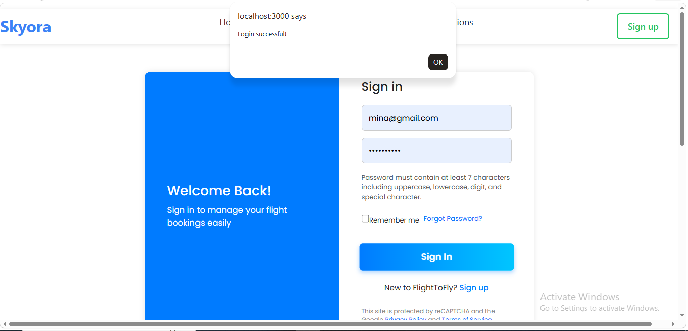
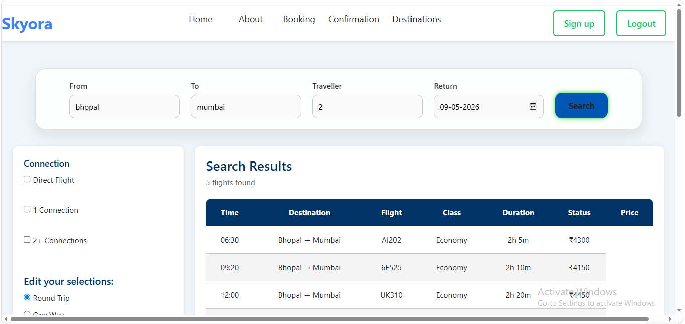
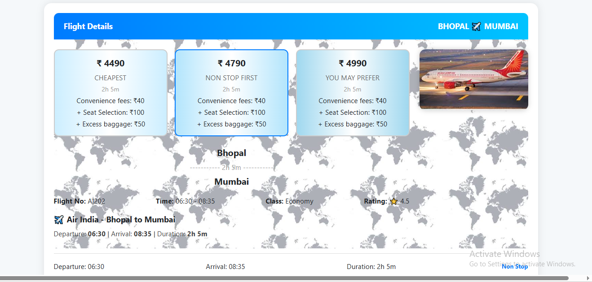
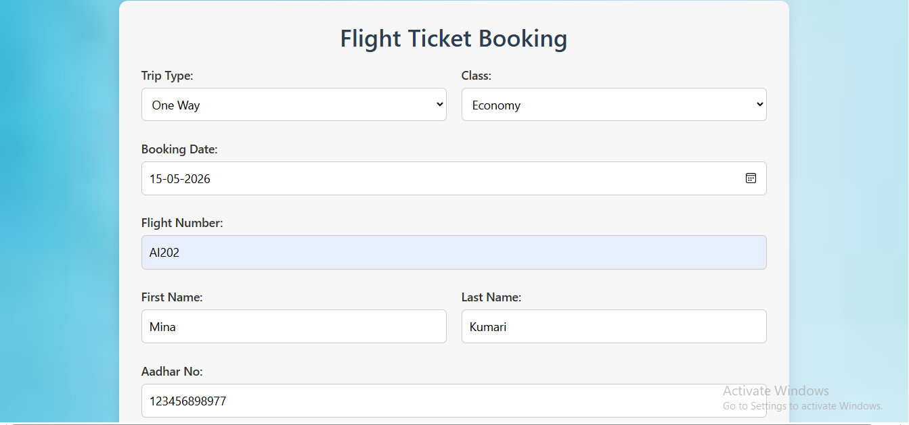
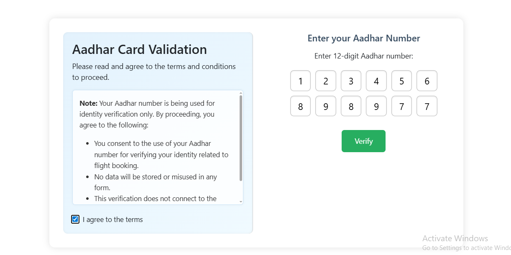
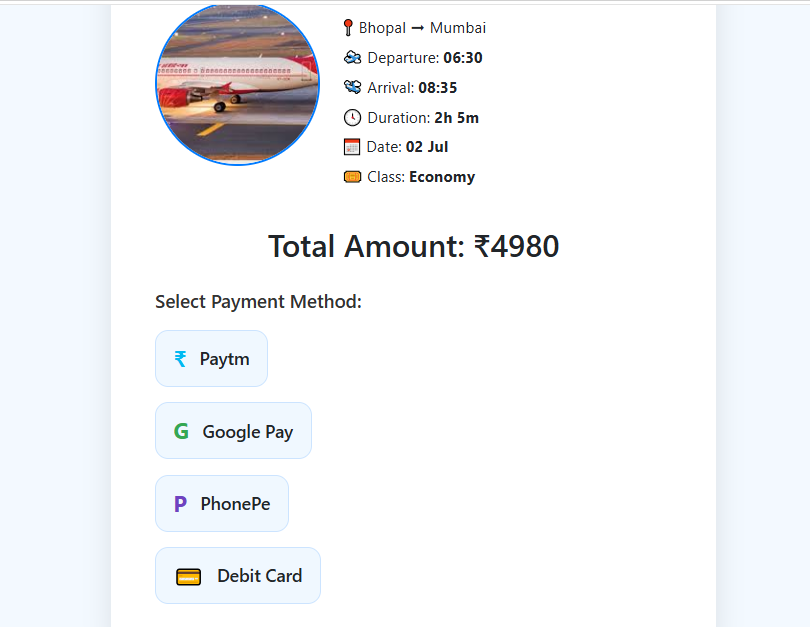
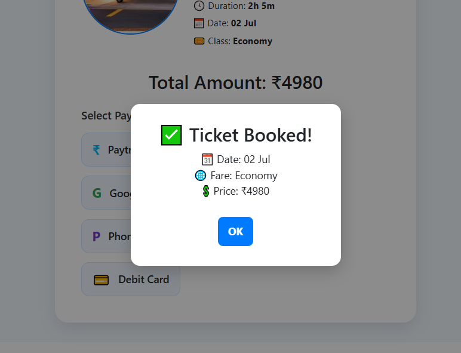
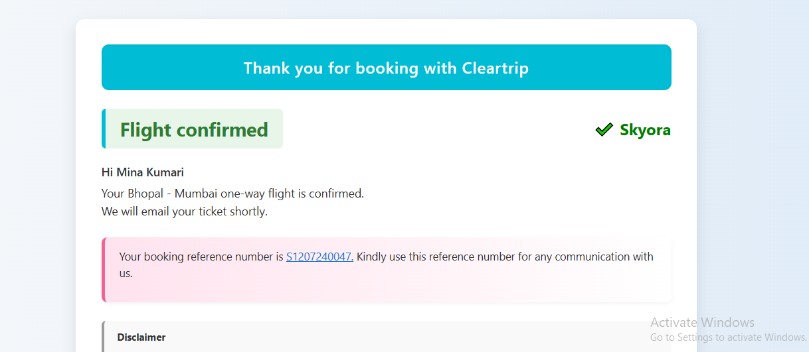

#      Skyora – Flight Booking Web Application. ✈️

Skyora is a flight booking web application designed to simulate a complete airline reservation workflow from user authentication to final ticket confirmation. Users can create an account, log in securely, and access features such as signup, login, logout, forgot password, and reset password functionality.

After authentication, users can search available flights based on their travel preferences. To simulate flight availability, I manually added around 30 flight records using a JSON file on the frontend. Once a user selects a flight, they are redirected to a flight details page where they can review flight information and continue with the booking process.

During booking, users enter details such as full name, Aadhaar number, date of birth, trip type, travel date, and class preference (Economy/Business). Users can also manually select their preferred seat before moving to the next step.

One of the unique features of this project is the Aadhaar verification system before payment. When users submit booking details, their Aadhaar number, name, and DOB are sent to the backend where MongoDB checks whether the Aadhaar already exists. If the Aadhaar number is linked with a different name, the booking is rejected. If the Aadhaar belongs to the same user, booking continues. If it is a new Aadhaar number, a new booking record is created. This helps prevent invalid bookings and adds backend validation logic to the project.

After successful verification, users proceed to the payment page where they can choose payment methods such as Paytm or Google Pay (simulation). Once payment is completed, the application generates a booking confirmation ticket that displays passenger details, seat number, travel information, and total charges.

## * Features.

- Signup/Login: User account authentication system.
- Forgot Password: Recover account access.
- Reset Password: Set a new password securely.
- Flight Search: Search flights using JSON-based flight data.
- Flight Details: View selected flight information.
- Seat Selection: Manually select seats from frontend UI.
- Aadhaar Verification: Backend checks user identity before payment
- Payment Simulation: Paytm/Google Pay payment flow simulation.
- Booking Confirmation: Generates final ticket with booking details.
            
## Tech Stack.

  - HTML.
  - CSS.
  - JavaScript.
  - React.js
  - Node.js
  - Express.js
  - MongoDB.
  - JSON.
  - dotenv.

## Project Flow.

User Registration/Login → Search Flights → Select Flight → Enter Details → Seat Selection → Aadhaar Verification → Payment → Ticket Confirmation.

## Screenshots.

### Home Page

### Login Page

### Flight Search Page

### Flight Details Page

### Booking Page

### Aadhaar Verification Page

### Payment Page

### Booking Confirmation 

### Confirmation page

## Future Improvements.

- Integrate real-time flight APIs for live flight data.  
- Add dynamic seat availability instead of manual seat selection.  
- Implement real payment gateway integration.  
- Add flight cancellation and refund functionality.  
- Send booking confirmation through email notifications.  
- Create an admin panel to manage flights and bookings. 

